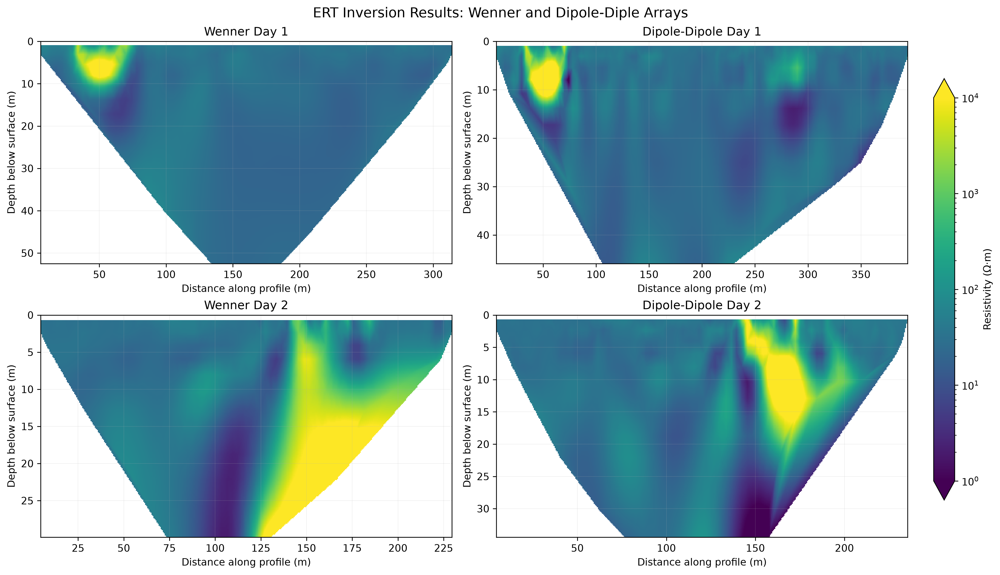
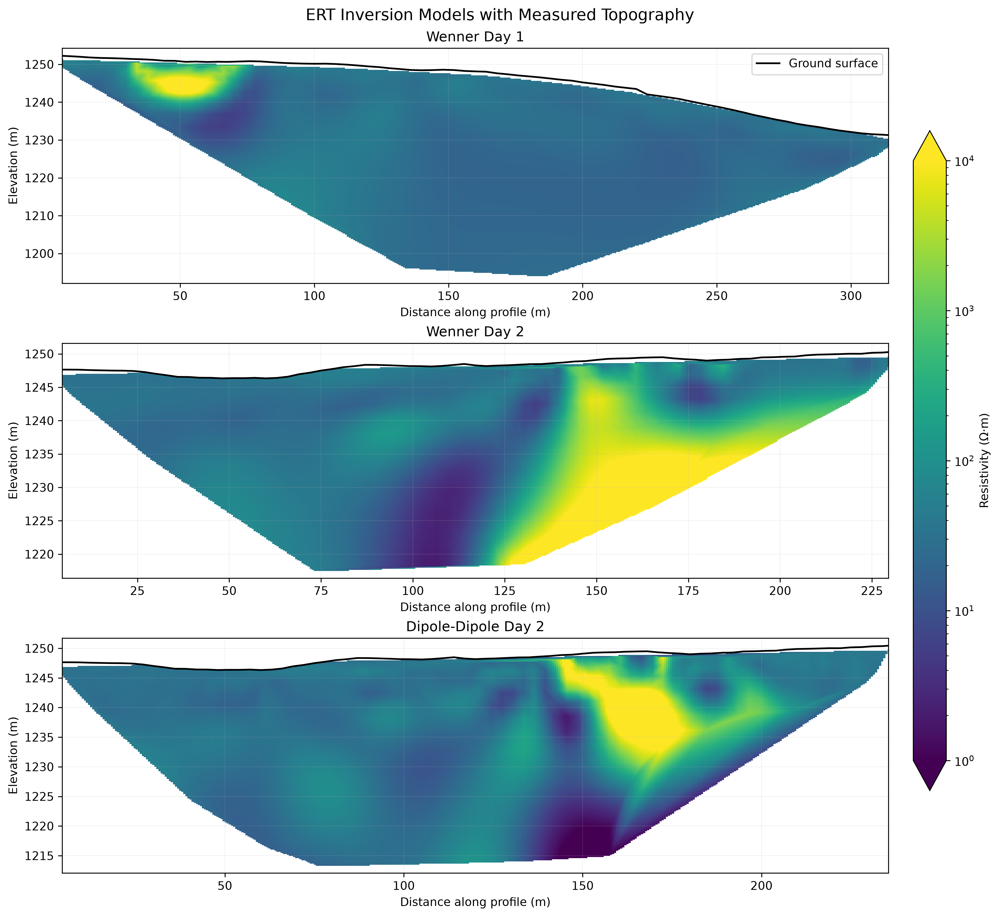

# Electrical Resistivity Tomography Visualization

Python tools for processing and visualizing 2-D Electrical Resistivity
Tomography (ERT) inversion results.

This project was developed from a university field geophysics survey and
refactored into a reusable Python workflow for loading RES2DINV model
exports, validating survey geometry, incorporating measured topography,
comparing electrode arrays, and creating interactive pseudo-3D
visualizations.

The project includes four ERT inversion models collected along two
approximately perpendicular survey lines using Wenner and dipole-dipole
arrays.

**Interactive project site:**  
https://thejuanestevez.github.io/ert-project/

## Project Overview

Electrical Resistivity Tomography is a geophysical method used to investigate
variations in subsurface electrical resistivity. Electrodes placed along the
ground surface are used to inject electrical current and measure resulting
potential differences. These measurements can then be inverted to estimate
the distribution of electrical resistivity beneath the survey line.

The field survey represented here contains:

- **Day 1**
  - 4 m electrode spacing
  - Wenner array
  - Dipole-dipole array
- **Day 2**
  - 3 m electrode spacing
  - Wenner array
  - Dipole-dipole array

The same physical electrode line was used for the Wenner and dipole-dipole
measurements on each survey day.

The resistivity measurements were processed and inverted externally using
**RES2DINV**. This repository begins with the exported inversion-model data
and focuses on the Python-based data processing and visualization workflow.

## Objectives

The project demonstrates how Python can be used to:

- parse RES2DINV `.xyz` model exports;
- validate model and survey geometry;
- compare multiple ERT inversion models using a consistent resistivity scale;
- incorporate measured electrode elevations;
- convert model depth into absolute elevation;
- interpolate irregular inversion-model blocks for visualization;
- compare Wenner and dipole-dipole survey responses;
- create publication-style 2-D resistivity sections; and
- create interactive pseudo-3D fence diagrams using Plotly.

## Example Visualizations

### Comparison of ERT Inversion Models

The four inversion models are displayed using a common logarithmic
resistivity scale so that differences between survey days and electrode
arrays can be compared directly.



### Topography-Corrected ERT Sections

Measured electrode elevations are interpolated along each profile and used
to convert model depth into absolute elevation.



Areas without support from the inversion-model blocks are intentionally left
blank rather than extrapolated.

## Interactive Pseudo-3D Visualization

Because the Day 1 and Day 2 survey lines are approximately perpendicular,
their 2-D inversion models can be displayed as intersecting vertical
sections.

Two interactive fence diagrams are included:

- [Open the interactive Wenner fence diagram](https://thejuanestevez.github.io/ert-project/interactive/ert_wenner_fence_diagram.html)
- [Open the interactive dipole-dipole fence diagram](https://thejuanestevez.github.io/ert-project/interactive/ert_dipole_dipole_fence_diagram.html)

The Plotly figures can be rotated, zoomed, and inspected interactively.
Hovering over the ERT sections displays profile distance, elevation, and
interpolated resistivity.

> **Important:** These figures combine independent 2-D inversions and are
> visualization tools only. They are not true 3-D ERT inversions. Because
> exact surveyed coordinates for the intersection are not available in the
> project files used here, the intersection shown in the fence diagrams is
> schematic.

## Repository Structure

```text
ert-project/
├── data/
│   ├── raw/
│   │   ├── Wenner_Day1.xyz
│   │   ├── Dipole_Dipole_Day1.xyz
│   │   ├── Wenner_Day2.xyz
│   │   └── Dipole_Dipole_Day2.xyz
│   └── electrode_elevations.csv
├── figures/
├── interactive/
│   ├── ert_wenner_fence_diagram.html
│   └── ert_dipole_dipole_fence_diagram.html
├── notebooks/
│   └── ert_visualization.ipynb
├── src/
│   └── ert_visualization/
│       ├── __init__.py
│       ├── io.py
│       ├── processing.py
│       ├── plotting.py
│       └── interactive.py
├── .gitignore
├── LICENSE
├── pyproject.toml
└── README.md
```

## Python Package

The processing and plotting functions are separated from the notebook into a
small Python package under `src/ert_visualization`.

### `io.py`

Handles loading and parsing of project data, including:

- RES2DINV `.xyz` inversion-model exports;
- model-block coordinates;
- resistivity values; and
- measured electrode elevations.

### `processing.py`

Contains data-processing and validation functions, including:

- survey/topography coverage validation;
- topography correction;
- conversion from model depth to absolute elevation;
- cropping models to measured survey coverage when required; and
- interpolation of irregular inversion-model blocks onto regular grids.

### `plotting.py`

Contains Matplotlib functions for:

- individual ERT sections;
- four-survey comparisons;
- topography-corrected sections; and
- common logarithmic resistivity scales.

### `interactive.py`

Contains Plotly tools for creating interactive pseudo-3D fence diagrams from
the approximately perpendicular Day 1 and Day 2 profiles.

## Interpolation and Resistivity Scaling

Electrical resistivity commonly spans several orders of magnitude. For this
reason, the visualizations use a logarithmic resistivity scale.

The default display range is:

```text
1 – 10,000 Ω·m
```

Values outside this range are retained in the processed data but are clipped
to the display limits for colour mapping.

Interpolation can be performed in either linear resistivity space or
`log10` resistivity space. Logarithmic interpolation is used by default
because it is better suited to quantities that span several orders of
magnitude.

Interpolation is restricted to the spatial support of the inversion model.
Regions outside that support are masked instead of being extrapolated.

## Survey Geometry Note

The exported **Dipole-Dipole Day 1** inversion model extends to approximately
394 m, while the measured Day 1 electrode and topography profile extends from
0 to 320 m.

The Wenner and dipole-dipole measurements were acquired using the same
physical electrode line, so the additional model extent is not interpreted
as additional measured survey coverage.

For topography-referenced visualizations, the Dipole-Dipole Day 1 model is
therefore cropped to the measured survey footprint. Model blocks outside the
measured profile are excluded rather than rescaled or assigned extrapolated
topography.

## Wenner vs. Dipole-Dipole

Using both arrays provides complementary views of the subsurface.

The **Wenner array** produces comparatively smooth and laterally continuous
resistivity structure.

The **dipole-dipole array** produces sharper lateral contrasts and greater
spatial variability.

Displaying both using the same resistivity scale makes these differences
easier to compare without treating either array as a direct ground-truth
representation of subsurface geology.

## Installation

Clone the repository:

```bash
git clone <https://github.com/thejuanestevez/ert-project.git>
cd ert-project
```

Create a virtual environment:

```bash
python -m venv .venv
```

Activate it on macOS or Linux:

```bash
source .venv/bin/activate
```

On Windows:

```powershell
.venv\Scripts\activate
```

Install the project and dependencies:

```bash
python -m pip install --upgrade pip
python -m pip install -e .
```

The main dependencies are:

- NumPy
- pandas
- SciPy
- Matplotlib
- Plotly
- nbformat

## Running the Notebook

Open:

```text
notebooks/ert_visualization.ipynb
```

in Jupyter or VS Code and run the notebook from top to bottom.

The notebook:

1. loads the four RES2DINV inversion models;
2. loads electrode elevations;
3. summarizes the survey datasets;
4. validates survey geometry;
5. generates depth-based ERT comparisons;
6. applies measured topography;
7. generates topography-corrected comparisons; and
8. creates interactive Wenner and dipole-dipole fence diagrams.

Generated static figures are written to:

```text
figures/
```

Interactive Plotly figures are written to:

```text
interactive/
```

## Limitations

ERT inversion is non-unique. A measured resistivity distribution does not
provide a unique geological interpretation, and similar resistivity values
can result from different combinations of lithology, porosity, saturation,
fluid chemistry, and other subsurface conditions.

The visualizations in this repository are interpolated from RES2DINV
model-block centres. Interpolation improves visualization but does not
increase the resolution of the original inversion.

The exported Dipole-Dipole Day 1 model extends beyond the measured Day 1
electrode and elevation profile. For topography-corrected visualization,
only the portion within the measured survey footprint is retained.

The pseudo-3D fence diagrams combine independent 2-D inversions. They should
not be interpreted as true 3-D resistivity models.

The exact surveyed coordinates of the intersection between the Day 1 and
Day 2 lines are not available in the project files used here. Their
intersection is therefore represented schematically in the interactive
visualizations.

## Technologies

- Python
- NumPy
- pandas
- SciPy
- Matplotlib
- Plotly
- Jupyter
- RES2DINV data exports
- Git / GitHub

## Future Improvements

Potential extensions to the project include:

- incorporating surveyed spatial coordinates for the ERT profiles;
- positioning the fence diagrams using true field geometry;
- integrating borehole information where reliable spatial coordinates are
  available;
- comparing ERT anomalies with independent geological constraints;
- adding automated tests for the data-processing functions; and
- publishing the interactive visualizations through GitHub Pages.

## Background

This project originated from field data collected as part of a university
geophysics project. The original work focused on interpreting several
near-surface geophysical methods.

This repository isolates the Electrical Resistivity Tomography component and
rebuilds the visualization workflow as a structured Python project with
reusable processing, plotting, and interactive visualization tools.

